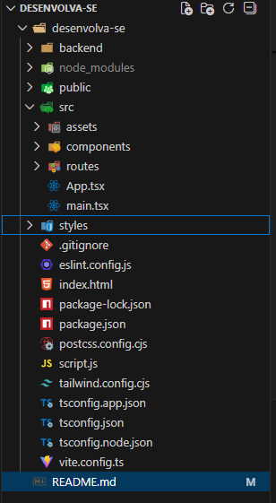
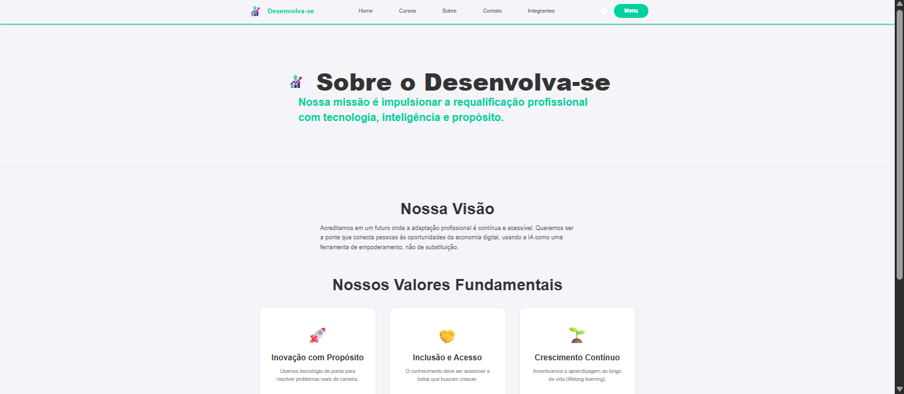

# 📘 Desenvolva-se — Plataforma Web

## 📌 Status do Projeto  
✔️ **Concluído / Entregue**

---

## 📄 Sumário
1. [Descrição](#descrição)  
2. [Sobre o Projeto](#sobre-o-projeto)  
3. [Tecnologias Utilizadas](#tecnologias-utilizadas)  
4. [Instalação](#instalação)  
5. [Como Usar](#como-usar)  
6. [Endpoints](#endpoints)  
7. [Estrutura de Pastas](#estrutura-de-pastas)  
8. [Autores e Créditos](#autores-e-créditos)  
9. [Screenshots e Demonstração](#screenshots-e-demonstração)  
10. [Links](#links)

---

## 📖 Descrição
O **Desenvolva-se** é uma plataforma web criada para fornecer informações institucionais e educacionais, com páginas de Home, Sobre, Cursos e Contato.  
Desenvolvida com foco em **responsividade, acessibilidade e boa organização de código**.

---

## 🧠 Sobre o Projeto
O objetivo do sistema é oferecer uma interface moderna e acessível, permitindo expansão futura para novos módulos, como integração com APIs, autenticação e dashboards administrativos.  
A plataforma utiliza componentes reutilizáveis, estilização centralizada e uma arquitetura simples de manter.

---

## 🚀 Tecnologias Utilizadas

### Frontend
- React + Vite  
- TypeScript  
- TailwindCSS  
- CSS Global  
- Git Flow  

### Backend
- API em Java  
  Repositório: https://github.com/Claytonasantos/API_JAVA_DESENVOLVA_SE  
- API auxiliar em Python (Flask)  
  Utilizada para o formulário de contato.

---

## 🛠️ Instalação

### 1 Clonar o repositório:

git clone https://github.com/Claytonasantos/desenvolva-se.git

### 2 abra o terminal do vscode na versao de cmd e digite para acessar a pasta:

cd desenvolva-se

### 3 instalar dependencias

npm install

### 4 iniciar a api de python

python backend/app.py

### 5 rodar o projeto

npm run dev

## Como Usar

http://localhost:5173/

## Endpoints

/ - pagina inicial

/curso - acessa os cursos disponíveis (Implementado no Front End)

/usuario - acessa os usuarios disponiveis

/profissao - acessa as profissões disponíveis

/recomendacao - acessa os indices de cada curso

## Estrutura de pastas

## Autores e Créditos

-   Clayton Alves dos Santos (RM: 562285)
-   Guilherme Sola Garcia (RM: 563674)
-   Pedro Santos Pequini (RM: 561842)

## Screenshots e demonstração

## Links

### Link do Repositório

https://github.com/Desenvolva-se-Org/Desenvolva-se.git

### API de Java

https://github.com/Claytonasantos/API_JAVA_DESENVOLVA_SE

### Video do YouTube

https://youtu.be/fe2X7dMMovo?si=yTZf3elbrKKOknLb